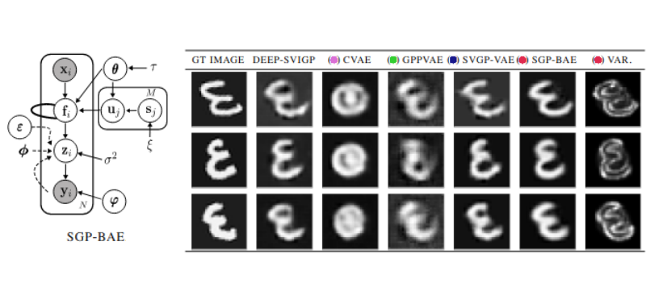

# Fully Bayesian Autoencoders with Latent Sparse Gaussian Processes

Code for the paper "Fully Bayesian Autoencoders with Latent Sparse Gaussian Processes".



## Dependencies

This repository was tested with Python 3.7, CUDA 10.0 and cuDNN 7.6.0 on Ubuntu 20.4.

Run the following command to install necessary python packages for the repository:

```bash
pip install -r requirements.txt
```

## Examples
Here are examples of `SGP-BAE` and `DSGP-BAE` models using shallow and deep `GP` priors, respectively: 

### SGP-BAE
```bash
python3 sgpbae_experiment.py \
    --out_dir="exp/mnist/sgpbae" \
    --lr=0.01 \
    --mdecay=0.01 \
    --n_samples=200
```

### DSGP-BAE
```bash
python3 dsgpbae_experiment.py \
    --out_dir="exp/dsgpbae/jura" \
    --lr=0.002 \
    --mdecay=0.05 \
    --n_samples=50
```

## Acknowledgement
Our code and experiments are based on the following repositories:
- [https://github.com/srossi93/Sparse-Gaussian-Processes-Revisited](https://github.com/srossi93/Sparse-Gaussian-Processes-Revisited)
- [https://github.com/ratschlab/SVGP-VAE](https://github.com/ratschlab/SVGP-VAE)
- [https://github.com/MattAshman/sgpvae](https://github.com/MattAshman/sgpvae)

## Contact
Feel free to contact me via email ([ba-hien.tran@eurecom.fr](ba-hien.tran@eurecom.fr)) if you have any issues or questions.

## Citation
When using this repository in your work, please consider citing our paper

```
@inproceedings{Tran2023,
  author    = {Tran, Ba-Hien and Shahbaba, Babak and Mandt, Stephan and Filippone, Maurizio},
  title     = {{Fully Bayesian Autoencoders with Latent Sparse Gaussian Processes}},
  booktitle = {Proceedings of the 40th International Conference on Machine Learning, ICML 2023},
  address   = {Honolulu, Hawaii, USA},
  publisher = {PMLR},
  series    = {Proceedings of Machine Learning Research},
  year      = {2023}
}
```
